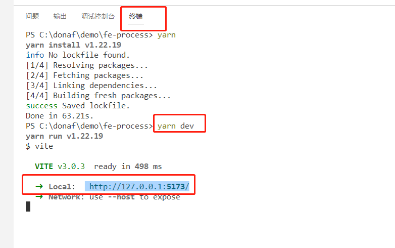
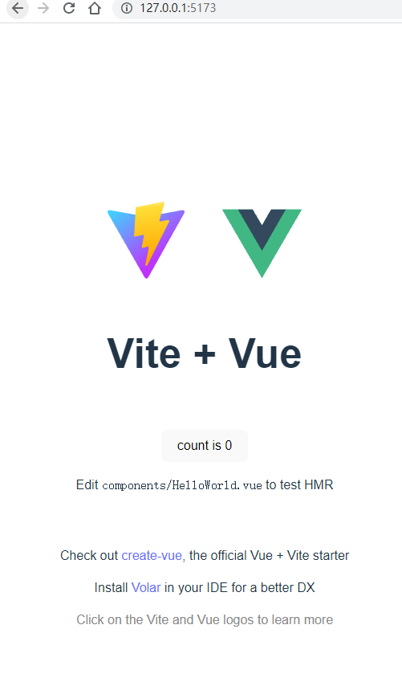

# 使用vue搭建项目
## 准备工作
全局安装以下包管理工具
```cmd
npm install yarn -g
npm install pnpm -g
```
## 初始化Vue项目
> 此处选用Vue3初始化项目

[Vue3官网](https://v3.cn.vuejs.org/)

通过在终端中运行以下命令，可以使用 Vite 快速构建 Vue 项目。

依次执行以下命令

``` cmd
$ yarn create vite fe-process-vue3 --template vue
$ cd fe-process-vue3
$ yarn
$ yarn dev
```
安装后，在vscode编辑器中打开项目，执行`yarn dev`后在浏览器中打开项目链接
```cmd
http://127.0.0.1:5173/
```


浏览器中打开，如下图


